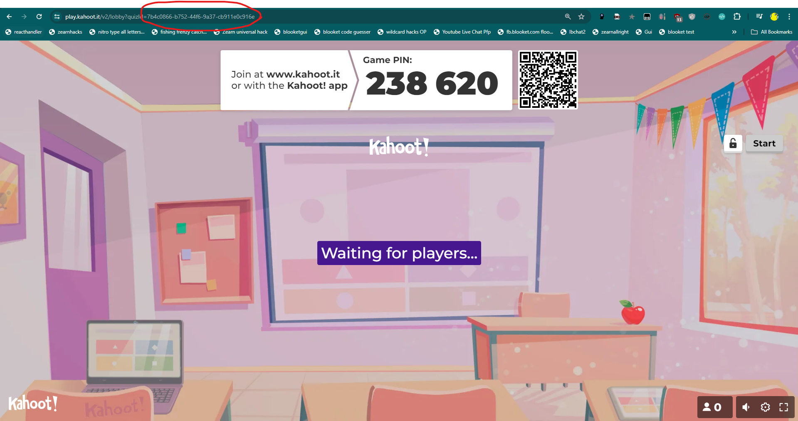

<h1>Instructions for use:</h1>
<ol>
<li>Go to kahoot.it</li>
<li>Run the script</li>
<li>Get quizid from teachers screen and put it into the hack</li>
<li>Join game (should tell you connecting to game in hack)</li>
<li>If you've made it this far, you're ready to start playing!</li>
</ol> 

Important notice: this hack only works if random answer choices are off! It works by changing a wrong answer to the right one, and if random answers are on it can't figure out which one is the right one!
 

Example of a quizid from the teachers screen: 

